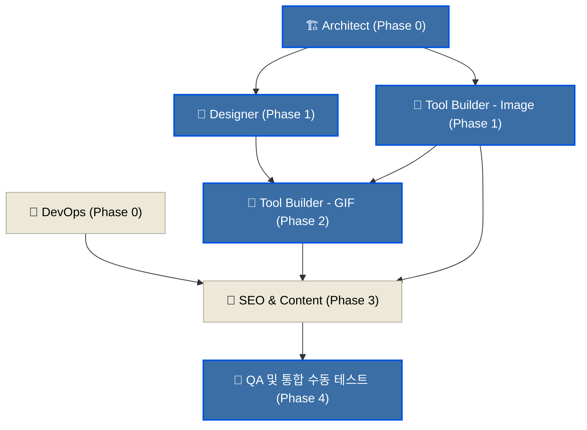

# 📑 ConvertFile — 멀티 에이전트 작업 명세 및 협업 규약 (Agent Tasks)

> AI 에이전트 그룹이 협업하여 ConvertFile 프로젝트를 완성하기 위한 역할 정의, 의존성 관계, 인터페이스 표준 규약, 그리고 각 역할별 실행 프롬프트 템플릿 정의 문서.

---

## 1. 에이전트 역할 정의 (Role Specifications)

본 프로젝트는 6개 에이전트 역할로 분담하여 작업을 수행하며, 단계별 완료 기준(Definition of Done)을 충족해야 다음 단계로 이동합니다.

| 에이전트 아이콘 & 명칭 | 주요 담당 영역 및 역할 | 핵심 산출물 | 완료 기준 (DoD) |
| :--- | :--- | :--- | :--- |
| **🏗️ Architect**<br>(아키텍트) | - 공통 레이아웃, 라우팅 설계<br>- 핵심 유틸리티 모듈 개발 | - `index.html`<br>- `/js/core/` 내 공통 엔진 모듈<br>- `/js/vendors/` 라이브러리 정렬 | - 로컬에서 각 도구의 테스트 템플릿 호출 가능<br>- 공통 UI 컴포넌트 프레임워크 동작 |
| **🎨 Designer**<br>(디자이너) | - Windows XP 테마 스타일링<br>- 반응형 UI 프레임워크 구축 | - `/css/xp-*.css`<br>- `/css/tools.css`<br>- `/assets/icons/` SVG 리소스 | - Windows XP Luna Blue 테마가 CSS로 완벽 픽셀 렌더링<br>- 모바일/태블릿 반응형 시트 동작 |
| **🔧 Tool Builder - Image**<br>(이미지 도구 빌더) | - Phase 1 이미지 변환 및 편집 도구 12개 구현 | - `/tools/` 이미지 관련 HTML 페이지<br>- `/js/tools/` 이미지 처리 로직 | - 각 이미지 변환/편집 기능이 캔버스상에서 정상 작동<br>- EXIF 및 파비콘 등 바이너리 처리 작동 |
| **🔧 Tool Builder - GIF**<br>(GIF 도구 빌더) | - Phase 2 GIF 제작, 분할, 최적화 모듈 구현 | - `/tools/gif-*.html` 페이지<br>- `/js/tools/gif-*.js` 렌더러 | - 복수 이미지로 GIF 애니메이션 빌드 완료 및 압축<br>- GIF 분할 후 다운로드 패키지 처리 정상 작동 |
| **📄 SEO & Content**<br>(SEO/콘텐츠 담당) | - 구글 애드센스 심사 통과 준비<br>- SEO 메타데이터 주입 및 사용가이드 작성 | - `/pages/` 법적 문서 및 소개 문서<br>- `sitemap.xml`, `robots.txt`, `ads.txt`<br>- 각 툴 사용법 본문 작성 | - 모든 정적 툴 페이지에 SEO 및 가이드 텍스트 삽입 완료<br>- 법적 필수 요건 페이지(개인정보 등) 생성 완료 |
| **🚀 DevOps**<br>(배포 및 운영 환경 설정) | - GitHub 저장소 연동<br>- Cloudflare Pages 배포 및 보안 룰 최적화 | - `.gitignore`<br>- `_headers` (보안 및 캐싱 헤더)<br>- `_redirects` 규칙 | - GitHub 메인 브랜치 푸시 시 Cloudflare Pages 빌드 성공<br>- HTTPS 및 보안 헤더(SharedArrayBuffer 대응) 검증 완료 |

---

## 2. 실행 순서 및 의존성 관계 (Dependency Graph)

각 에이전트 간의 작업 선후 관계는 아래와 같습니다. `Architect`와 `DevOps`가 먼저 기본 뼈대를 수립해야 다른 에이전트들이 스타일과 실제 동작 로직을 결합할 수 있습니다.



---

## 3. 에이전트 간 인터페이스 및 협업 규약 (Inter-Agent Protocols)

에이전트들이 생성하는 소스 코드가 충돌하지 않고 결합할 수 있도록 BEM 명명법, 공통 마크업 스키마, 에러 처리 패턴을 통일합니다.

### 3.1 파일 구조 및 네이밍 컨벤션
- **HTML 파일**: 소문자 및 하이픈 케이스(kebab-case)를 사용합니다.
  - 예: `/tools/jpg-png.html`, `/tools/gif-maker.html`
- **JS 파일**: 도구 페이지와 동일한 이름으로 스크립트를 생성합니다.
  - 예: `/js/tools/jpg-png.js`, `/js/tools/gif-maker.js`
- **클래스명 (BEM 방식)**:
  - 블록(Block): `xp-window`, `xp-button`, `xp-menu` 처럼 `xp-` 접두어를 붙입니다.
  - 엘리먼트(Element): `xp-window__title`, `xp-window__body` 처럼 더블 언더바(`__`)로 구분합니다.
  - 수식어(Modifier): `xp-button--pressed`, `xp-button--disabled` 처럼 더블 하이픈(`--`)으로 구분합니다.

### 3.2 HTML 기본 템플릿 구조
모든 도구 페이지는 디자이너가 작성한 스타일 및 아키텍트가 정의한 공통 프레임을 공통으로 사용하기 위해 다음 마크업 뼈대를 준수해야 합니다.

```html
<!DOCTYPE html>
<html lang="ko">
<head>
    <meta charset="UTF-8">
    <meta name="viewport" content="width=device-width, initial-scale=1.0">
    <title>이미지 리사이즈 - ConvertFile</title>
    <!-- Windows XP 공통 스타일 파일 로드 -->
    <link rel="stylesheet" href="/css/xp-reset.css">
    <link rel="stylesheet" href="/css/xp-theme.css">
    <link rel="stylesheet" href="/css/xp-components.css">
    <link rel="stylesheet" href="/css/tools.css">
</head>
<body class="xp-desktop">
    <!-- XP 스타일 윈도우 컨테이너 -->
    <div class="xp-window" id="main-tool-window">
        <div class="xp-window__title-bar">
            <div class="xp-window__title-text">Image Resizer.exe</div>
            <div class="xp-window__title-buttons">
                <button class="xp-title-btn xp-title-btn--minimize" aria-label="Minimize"></button>
                <button class="xp-title-btn xp-title-btn--maximize" aria-label="Maximize"></button>
                <button class="xp-title-btn xp-title-btn--close" aria-label="Close"></button>
            </div>
        </div>
        
        <!-- 상단 메뉴 바 (XP 파일/편집/도움말 구조) -->
        <nav class="xp-menu-bar">
            <div class="xp-menu-item">파일(F)</div>
            <div class="xp-menu-item">도구(T)</div>
            <div class="xp-menu-item">도움말(H)</div>
        </nav>

        <!-- 핵심 워크스페이스 본문 영역 -->
        <div class="xp-window__body">
            <!-- 툴 전용 업로더 및 조작부 패널 마크업이 이곳에 정의됨 -->
            <div class="xp-tool-container">
                <!-- 1. 업로드 영역 -->
                <div class="xp-upload-zone" id="drop-zone">
                    <p>이미지 파일을 이리로 드래그하거나 클릭하여 로드하십시오.</p>
                </div>
                <!-- 2. 컨트롤 영역 -->
                <div class="xp-control-panel">
                    <!-- 도구별 픽셀, 품질 제어 폼 배치 -->
                </div>
            </div>
        </div>

        <!-- 하단 상태 표시줄 (Status Bar) -->
        <footer class="xp-status-bar">
            <div class="xp-status-bar__panel">준비 완료</div>
            <div class="xp-status-bar__panel xp-status-bar__panel--right">Memory: 0MB</div>
        </footer>
    </div>

    <!-- 공통 로직 및 개별 툴 핵심 스크립트 바인딩 -->
    <script src="/js/core/image-loader.js"></script>
    <script src="/js/core/canvas-utils.js"></script>
    <script src="/js/tools/resize.js"></script>
</body>
</html>
```

### 3.3 에러 처리 및 얼럿 창 패턴 (XP Error Dialog)
처리 중 발생한 모든 실패 케이스는 브라우저 기본 `alert()` 대신, 아래의 HTML/DOM 구조를 동적으로 생성하여 띄워주는 XP 에러 다이얼로그 모달 공통 함수(`UIComponents.showErrorDialog(title, message)`)를 호출해야 합니다.

```javascript
// /js/core/ui-components.js 내에 정의
const UIComponents = {
    showErrorDialog: function(title, message) {
        const dialogHtml = `
            <div class="xp-modal-overlay">
                <div class="xp-window xp-window--dialog xp-window--error" role="alertdialog">
                    <div class="xp-window__title-bar">
                        <div class="xp-window__title-text">${title}</div>
                        <div class="xp-window__title-buttons">
                            <button class="xp-title-btn xp-title-btn--close" onclick="this.closest('.xp-modal-overlay').remove()"></button>
                        </div>
                    </div>
                    <div class="xp-window__body xp-window__body--dialog">
                        <div class="xp-dialog-icon xp-dialog-icon--error"></div>
                        <div class="xp-dialog-message">${message}</div>
                    </div>
                    <div class="xp-dialog-actions">
                        <button class="xp-btn" onclick="this.closest('.xp-modal-overlay').remove()">확인</button>
                    </div>
                </div>
            </div>
        `;
        document.body.insertAdjacentHTML('beforeend', dialogHtml);
    }
};
```

---

## 4. 에이전트별 프롬프트 템플릿 (Prompt Templates)

각 에이전트를 `invoke_subagent` 툴로 가동할 때 주입해야 할 세부 미션 프로토콜 및 프롬프트 양식입니다.

### 4.1 🏗️ Architect 에이전트 프롬프트
```markdown
[역할] 🏗️ Architect
[목표] ConvertFile의 공통 디렉토리 및 메인 프레임워크 뼈대를 설계하고 공통 코어 JS 엔진을 구축하십시오.

[작업 범위]
1. /index.html 메인 파일 레이아웃 수립
2. 공통 Javascript 코어 모듈 구현:
   - `/js/core/image-loader.js`: 드래그앤드롭, 파일업로드 폼 입력, URL 주소 붙여넣기 시 이미지를 로드하여 공통 캔버스 파이프라인으로 넘겨주는 모듈.
   - `/js/core/canvas-utils.js`: 캔버스 리사이징, 회전, 포맷별 DataURL/Blob 래핑 처리.
   - `/js/core/file-utils.js`: 생성된 파일 다운로드 및 확장자 검증.
3. `/js/vendors/` 디렉토리에 필요한 오픈소스 라이브러리 (gif.js, pdf-lib 등)를 배치 및 초기 로드 가이드 수립.

[산출 조건]
- Javascript는 Vanilla ES6 모듈 패턴(import/export)을 활용해 모듈화하십시오.
- 코드는 영어로 작성하고, 내부 주석은 한국어로 상세하게 다십시오.
```

### 4.2 🎨 Designer 에이전트 프롬프트
```markdown
[역할] 🎨 Designer
[목표] Windows XP Luna Blue(파란색 클래식 테마)의 비주얼과 컴포넌트 CSS 전체를 구현하십시오.

[작업 범위]
1. `/css/xp-reset.css`, `xp-theme.css`, `xp-components.css` 작성.
2. Windows XP 전용 컴포넌트 세팅:
   - 3D 입체 테두리를 지닌 윈도우 창 (`xp-window`)
   - 눌렀을 때 들어가는 입체감 있는 버튼 (`xp-btn`)
   - 윈도우 XP 테두리가 적용된 입력창 및 선택창
   - 진행 중 연두색 블록이 채워지는 애니메이션 진행바 (`xp-progress-bar`)
   - 노란색 바탕의 XP 말풍선 경고창 (`xp-balloon-tip`)
3. SVG 기반으로 저작권에 위배되지 않는 클래식 윈도우 스타일 아이콘 팩 구현 (폴더, 내컴퓨터, 리사이즈, 크롭, 회전 등).

[산출 조건]
- 순수 CSS(Vanilla CSS)로만 스타일링을 진행하십시오. TailwindCSS는 사용하지 마십시오.
- 반응형 웹 디자인을 적용하되 모바일에서는 상단 프레임 및 메인 조작 윈도우가 화면 전체 너비로 꽉차는 컴팩트 모드로 자동 폴백되도록 CSS를 작성하십시오.
```

### 4.3 🔧 Tool Builder - Image 에이전트 프롬프트
```markdown
[역할] 🔧 Tool Builder - Image
[목표] ConvertFile의 Phase 1 이미지 변환 및 편집 개별 툴 12종을 구현하십시오.

[작업 범위]
- 대상 도구 목록: JPG↔PNG, WebP변환, ICO 변환, SVG to PNG, 리사이즈, 크롭, 회전, 압축최적화, 필터조정, 배경제거, 테두리, 텍스트합성.
- 각 도구별 `/tools/[tool-name].html` 및 `/js/tools/[tool-name].js`를 독립적 세트로 개발하십시오.

[산출 조건]
- Architect가 작성한 `/js/core/` 라이브러리를 적극 재활용하십시오.
- 각 툴은 완전하게 자립 가동되어야 하며, 데이터 유출이 없는 순수 클라이언트 단 처리를 보장해야 합니다.
```

### 4.4 🔧 Tool Builder - GIF 에이전트 프롬프트
```markdown
[역할] 🔧 Tool Builder - GIF
[목표] Phase 2에 할당된 프레임 기반 GIF 편집 도구를 개발하십시오.

[작업 범위]
- 대상 도구: GIF 메이커 (여러 이미지 병합), GIF 프레임 디코더/분할기, GIF 크기조절/크롭/최적화 툴, 역재생 및 프레임 레이트 스피드 컨트롤러.
- GIF 렌더링 시 UI의 메인 스레드가 정지하지 않도록 `gif.js`의 Web Worker 환경 설정을 병행하십시오.

[산출 조건]
- GIF 인코딩 시 연두색 XP 진행바가 0%에서 100%까지 렌더링 진행률과 맵핑되어 변하도록 콜백 이벤트 리스너를 바인딩하십시오.
```

### 4.5 📄 SEO & Content 에이전트 프롬프트
```markdown
[역할] 📄 SEO & Content
[목표] 구글 애드센스 심사를 무사히 통과하기 위한 고품질 정적 정보성 콘텐츠 페이지와 메타 데이터 시스템을 보충하십시오.

[작업 범위]
1. 필수 4대 법적/소개 페이지 구축:
   - `/pages/about.html` (서비스 목적 및 소개)
   - `/pages/privacy.html` (개인정보처리방침 - GDPR 대응 고지)
   - `/pages/terms.html` (이용약관 및 책임 부인 조항)
   - `/pages/contact.html` (문의 폼)
2. 각 툴 페이지 하단에 최소 300자 이상의 친절한 사용 설명 가이드 단락 및 FAQ 구조화 마크업 추가.
3. 구글 광고 등록을 위한 `ads.txt` 파일 및 포털 검색엔진 크롤러 유입용 `sitemap.xml`, `robots.txt` 파일 작성.
```
